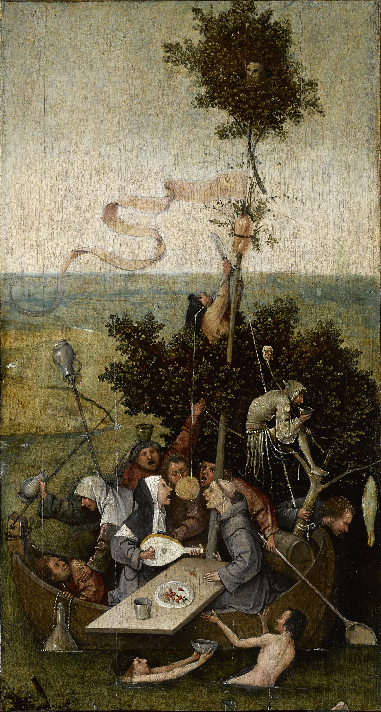

# Narrenschiff

> Imagine then a fleet or a ship in which there is a captain who is taller and stronger than any of the crew, but he is a little deaf and has a similar infirmity in sight, and his knowledge of navigation is not much better. The sailors are quarreling with one another about the steering––every one is of the opinion that he has a right to steer, though he has never learned the art of navigation and cannot tell who taught him or when he learned, and will further assert that it cannot be taught, and they are ready to cut in pieces any one who says the contrary. They throng about the captain, begging and praying him to commit the helm to them; and if at any time they do not prevail, but others are preferred to them, they kill the others or throw them overboard, and having first chained up the noble captain's senses with drink or some narcotic drug, they mutiny and take possession of the ship and make free with the stores; thus, eating and drinking, they proceed on their voyage in such a manner as might be expected of them. Him who is their partisan and cleverly aids them in their plot for getting the ship out of the captain's hands into their own whether by force or persuasion, they compliment with the name of sailor, pilot, able seaman, and abuse the other sort of man, whom they call a good-for-nothing; but that the true pilot must pay attention to the year and seasons and sky and stars and winds, and whatever else belongs to his art, if he intends to be really qualified for the command of a ship, and that he must and will be the steerer, whether other people like or not––the possibility of this union of authority with the steerer's art has never seriously entered into their thoughts or been made part of their calling. Now in vessels which are in a state of mutiny and by sailors who are mutineers, how will the true pilot be regarded? Will he not be called by them a prater, a star-gazer, a good-for-nothing?
> Plato, Republic

Ansible-like configuration management for the Kubernetes.



## Quickstart

Install the tool, and write your `course` file:

```yaml
# dev/tasks.yaml
- name: Deploy config map
  kubectl:
    command: apply
    args:
      filename: "{{ files_path }}/configmap.yaml"

- name: Apply namespaces and RBAC settings
  kubectl:
    command: apply
    args:
      filename:
        - dev/files/namespaces.yaml
        - dev/files/rbac.yaml
        - dev/files/statefulset.yaml  # <-- you need db_password for this
```

Add variables in vars files:

```yaml
# dev/vars.yaml
files_path: dev/files
```

And hide your treasure in the chest!

```sh
touch dev/chest.yaml
narrenschiff chest hide --treasure 'db_password' --value 'password' --location 'dev/'
```

Use `Jinja2` templating to be more flexible with your manifests. When yore ready, deploy:

```sh
narrenschiff deploy --set-course dev/tasks.yaml
```
